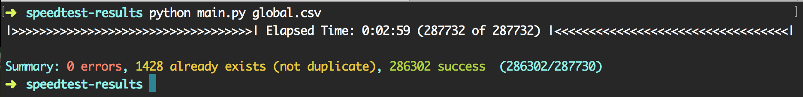

# Speedtest reporting inject

This script help you to organize and store results from your speedtest hodted server.

## How to use ?

1. Clone this repo
		`git clone https://github.com/MyTheValentinus/speedtest-reporting-injector.git`
2. Download your results as CSV format from [reporting.speedtest.net](https://reporting.speedtest.net/)
3. Import SQL schema in your database (`schema.sql`)
4. Setup your MySQL database in the `config.ini` file
```
[mysql]
host = 127.0.0.1
port = 3306
socket = /Applications/MAMP/tmp/mysql/mysql.sock
user = root
database = speedtest
password = root
```
5. Launch script with exported file in first argument
`python main.py /home/user/Downloads/demo.csv`
6. Wait and see, your database is filled !



Give me feedback on Twitter: [Valentin Deville](https://twitter.com/MyTheValentinus)